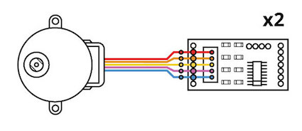
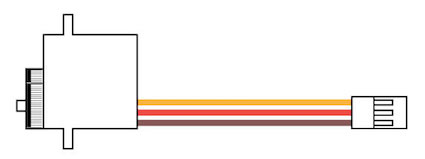
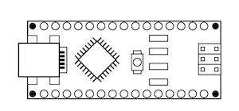
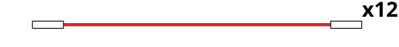
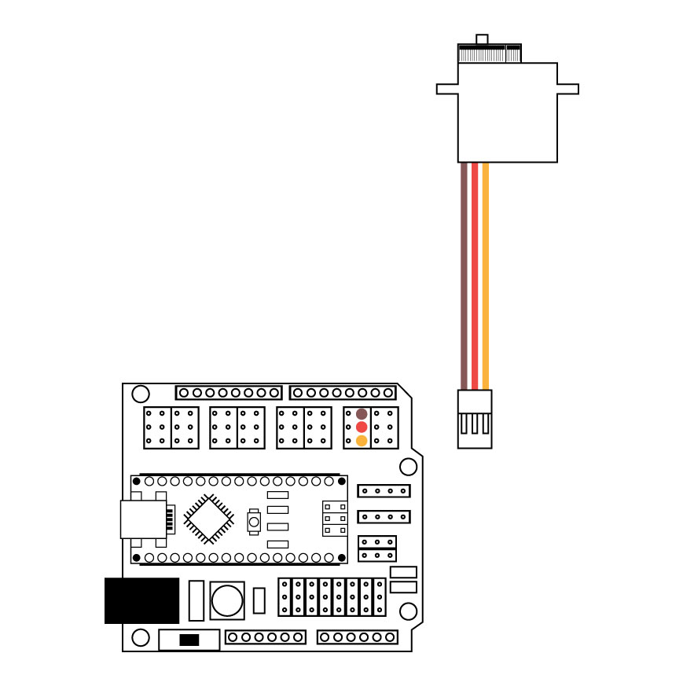
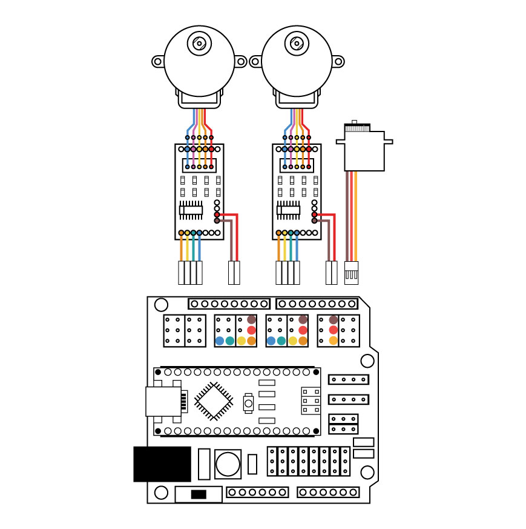

Projeto de um robô desenhista por [Monica Rizzolli](https://github.com/MonicaRizzolli/) e [João Adriano Freitas](https://github.com/jaafreitas/).

[Foto da primeira versão a frente e segunda versão ao fundo](https://scontent-gru2-2.xx.fbcdn.net/v/t31.0-8/20989263_1151005741696353_320877582461856894_o.jpg?oh=a3e206db3cbcc99220484db0424a8afe&oe=5AEBBE06)

[Vídeo demonstração](https://youtu.be/GalOWkOCb_o)

Ilustrações: Monica Rizzolli

## Lista de materiais

* 2 motores de passo 28BYJ-48 5VDC

   

* 1 micro servo 9g SG90

   

* 1 Arduino Nano

   

* 1 Placa Shield de Expansão para Arduino Nano

   

* 1 Cabo USB compatível com Arduino Nano (ponta 'mini', não 'micro')

* 12 Jumpers fêmea-fêmea

   

## Montagem eletrônica
* Micro servo na porta digital 2: fio laranja no S, vermlho no V e marrom no G

  

* Motor de passo da direita: pino digital S 4 no IN1, S 5 no IN2, S 6 no IN3 e S 7 no IN4. Alimentação 4 V no + e 4 G no -.

* Motor de passo da esquerda: pino digital S 8 no IN1, S 9 no IN2, S 10 no IN3 e S 11 no IN4. Alimentação 8 V no + e 4 G no -.

