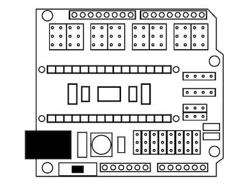

Projeto de um robô desenhista por [Monica Rizzolli](https://github.com/MonicaRizzolli/) e [João Adriano Freitas](https://github.com/jaafreitas/). Inspirado no [Open Source Turtle Robot ](https://github.com/aspro648/OSTR) por MakersBox.

[Vídeo demonstração](https://youtu.be/GalOWkOCb_o)

Ilustrações: Monica Rizzolli

## Lista de materiais

* 2 motores de passo 28BYJ-48 5VDC

   

* 1 micro servo 9g SG90

   

* 1 Arduino Nano

   

* 1 Placa Shield de Expansão para Arduino Nano

   

* 1 Cabo USB compatível com o Arduino Nano

* 12 Jumpers fêmea-fêmea

   
   
* 14 porcas fêmeas hexagonal M3
* 18 parafusos Allen M3x8
* 14 parafusos cabeça redonda M2.5x8
* 1 bola de metal 5/8"
* 2 anéis de borracha (O-ring) 1 7/8" x 1/8"

## Montagem eletrônica
* Micro servo na porta digital 2: fio laranja no S, vermlho no V e marrom no G

  

* Motor de passo da direita: pino digital S 4 no IN1, S 5 no IN2, S 6 no IN3 e S 7 no IN4. Alimentação 4 V no + e 4 G no -.

* Motor de passo da esquerda: pino digital S 8 no IN1, S 9 no IN2, S 10 no IN3 e S 11 no IN4. Alimentação 8 V no + e 4 G no -.

## Licença
[Attribution-ShareAlike 3.0 United States (CC BY-SA 3.0 US)](https://creativecommons.org/licenses/by-sa/3.0/us/)

